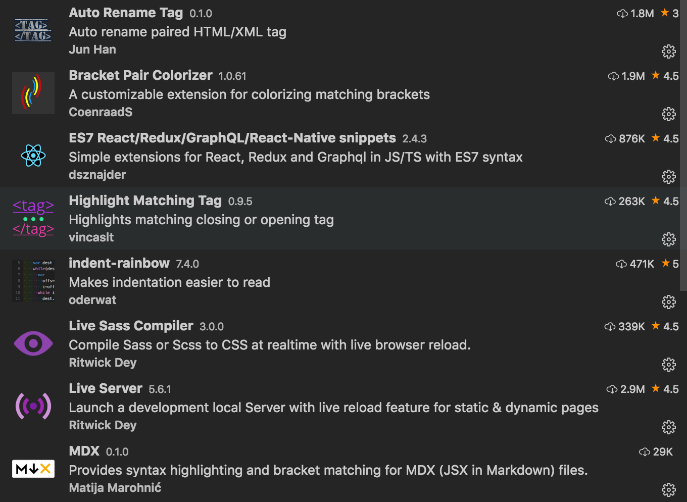

# VS CODE SETUP

## EXTENSIONS

;

#### _Auto Rename Tag_

Auto rename paired HTML/XML tag

#### _Bracket Pair Colorizer_

A customizable extension for colorizing matching brackets

```javascript
"highlight-matching-tag.styles": {
    "opening": {
      "left": {
        "custom": {
          "borderWidth": "0 0 0 3px",
          "borderStyle": "solid",
          "borderColor": "yellow",
          "borderRadius": "5px"
        }
      },
      "right": {
        "custom": {
          "borderWidth": "0 3px 0 0",
          "borderStyle": "solid",
          "borderColor": "yellow",
          "borderRadius": "5px"
        }
      }
    }
  }
```

```

```
